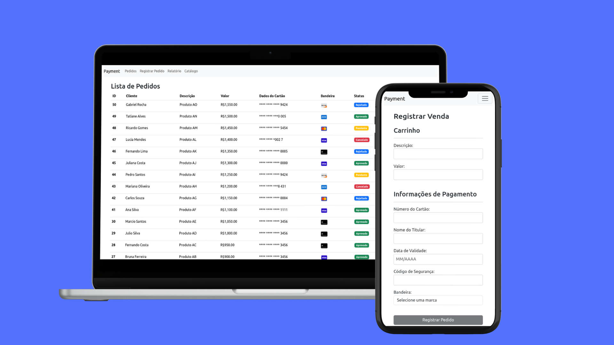

  


# **Payment**

 

**Descrição**: 

Esta aplicação foi desenvolvida para permitir o registro de compras fictícias e a realização do processo de pagamento utilizando a API de Sandbox da Cielo. O projeto inclui a implementação tanto do front-end quanto do back-end, garantindo uma comunicação eficiente e segura entre as duas camadas, bem como uma integração robusta com a API da Cielo.

O front-end foi criado para oferecer uma interface amigável e intuitiva, onde os usuários podem inserir os detalhes da compra e acompanhar o status das transações. Já o back-end é responsável por processar os dados, comunicar-se com a API da Cielo para efetuar os pagamentos e retornar os resultados ao front-end.

## **Sumário**

- [Introdução](#introdução)
- [Funcionalidades](#funcionalidades)
- [Tecnologias Utilizadas](#tecnologias-utilizadas)
- [Instalação](#instalação)
- [Como Usar](#como-usar)
- [Possíveis Evoluções Futuras](#possíveis-evoluções-futuras)
- [Licença](#licença)
- [Contato](#contato)

## **Introdução**

Este projeto foi concebido como uma solução completa para simular o processo de registro e pagamento de compras fictícias, utilizando a API de Sandbox da Cielo. Com a crescente demanda por sistemas de pagamento integrados, esta aplicação serve como um exemplo prático de como implementar um fluxo de pagamento end-to-end, desde a interface de usuário até a comunicação segura com uma API de terceiros. Ao integrar front-end e back-end de forma coesa, o projeto oferece uma plataforma para aprender e explorar as melhores práticas em desenvolvimento full-stack, especialmente no contexto de transações financeiras digitais.

## **Funcionalidades**

- **Registro de Vendas**: Permite ao usuário registrar dados de uma compra fictícia, incluindo descrição, valor e informações do cartão de crédito.
- **Processamento de Pagamento**: Integração com a API de Sandbox da Cielo para processar o pagamento das vendas registradas, com captura automática.
- **Exibição do Status da Transação**: Mostra o status da transação (sucesso ou falha) após o processamento do pagamento.
- **Tratamento de Erros e Validações**: Implementação de validações nos formulários do front-end e tratamento adequado de erros para garantir a consistência e segurança dos dados inseridos.
- **Listagem de Vendas**: Exibe uma lista completa de todas as vendas realizadas, permitindo ao usuário visualizar o histórico de transações.
- **Cancelamento de Vendas**: Funcionalidade adicional que permite o cancelamento de uma venda e do pagamento correspondente junto à Cielo.
- **Criptografia de Dados Sensíveis**: Implementação de criptografia para proteger os dados sensíveis, como informações do cartão de crédito, garantindo a segurança durante o processamento.

## **Tecnologias Utilizadas**

- **Frontend**: Angular, HTML5, CSS3, Bootstrap
- **Backend**: Spring Boot, Java
- **Banco de Dados**: PostgreSQL
- **Outras Tecnologias**: Docker, Docker Compose, Cielo API (Sandbox)

## **Instalação**

Siga os passos abaixo para configurar o ambiente e rodar a aplicação localmente:

### 1. Banco de Dados

1. Clone o repositório do projeto:
    ```bash
    git clone https://github.com/weversonbdelima/payment.git
    ```

2. Entre no diretório do projeto:
    ```bash
    cd payment
    ```

3. Inicie o banco de dados utilizando o Docker Compose:
    ```bash
    docker-compose up
    ```

### 2. Backend

4. Entre na pasta do backend:
    ```bash
    cd backend
    ```

5. Instale as dependências do backend:
    ```bash
    mvn install
    ```

6. Execute o backend utilizando o Maven:
    ```bash
    mvn spring-boot:run
    ```

### 3. Frontend

7. Para rodar o frontend, abra um novo terminal, entre na pasta do frontend:
    ```bash
    cd frontend
    ```

8. Instale as dependências do frontend:
    ```bash
    npm install
    ```

9. Execute o servidor do frontend utilizando o Angular CLI:
    ```bash
    ng serve
    ```

Após seguir esses passos, tanto o backend quanto o frontend estarão em execução, e você poderá acessar a aplicação no navegador.

## **Como Usar?**

Após a instalação e execução do banco de dados, backend e frontend, siga os passos abaixo para utilizar a aplicação:

1. **Acesse a Aplicação**:
   - Abra um navegador e acesse o endereço:
     ```
     http://localhost:4200
     ```
   - Esta URL corresponde ao frontend da aplicação.

2. **Registrar uma Venda**:
   - Na interface do usuário, preencha os campos do formulário com os dados da venda:
     - Descrição da venda.
     - Valor da venda.
     - Dados do cartão de crédito (número, validade, CVV).
   - Clique no botão para registrar a venda.

3. **Listar Vendas Realizadas**:
   - Acesse a seção de listagem de vendas para visualizar todas as vendas registradas.

4. **Cancelar uma venda**:
   - Caso a venda registrada permita o cancelamento, você poderá clicar na opção correspondente para cancelar a venda e o pagamento junto à Cielo.

5. **Monitorar Erros**:
   - Em caso de erros, verifique as mensagens exibidas na interface e os logs no terminal onde o backend está em execução para identificar e resolver os problemas.

Após seguir esses passos, você poderá registrar e gerenciar vendas fictícias utilizando a aplicação.

## **Possíveis Evoluções Futuras**

Embora o projeto atual atenda aos requisitos básicos de registro de compras e processamento de pagamentos, existem diversas melhorias e funcionalidades que podem ser implementadas para ampliar a robustez e a usabilidade do sistema. Abaixo estão algumas sugestões:

1. **Desenvolvimento Mobile**: 
   - A criação de um aplicativo mobile permitiria que os usuários registrassem compras e realizassem pagamentos diretamente de seus dispositivos móveis. Isso tornaria a experiência do usuário mais conveniente e acessível, aumentando a interação com a aplicação.

2. **Paginação para Otimizar o Carregamento**:
   - Implementar a paginação nas listas de vendas e transações poderia melhorar significativamente o desempenho da aplicação, especialmente em casos onde há um grande volume de dados. Isso reduziria o tempo de carregamento das páginas e tornaria a interface mais responsiva.

3. **Implementação de Balanceamento de Carga**:
   - Para garantir que a aplicação possa escalar adequadamente em ambientes de alta demanda, a implementação de um sistema de balanceamento de carga seria benéfica. Isso garantiria que as requisições dos usuários fossem distribuídas de maneira eficiente entre múltiplas instâncias do servidor, melhorando a disponibilidade e a confiabilidade do sistema.

4. **Integração com Outros Métodos de Pagamento**:
   - Além da API de Sandbox da Cielo, considerar a integração com outros métodos de pagamento (como PayPal, PIX, entre outros) poderia ampliar as opções disponíveis para os usuários, aumentando a flexibilidade e a conveniência na hora de realizar transações.

5. **Relatórios e Análises**:
   - Adicionar uma funcionalidade de relatórios poderia fornecer aos usuários insights valiosos sobre suas transações, como tendências de compra, produtos mais vendidos e análises financeiras. Isso ajudaria na tomada de decisões informadas e estratégicas.

6. **Autenticação e Autorização Avançadas**:
   - Implementar um sistema de autenticação e autorização mais robusto, como OAuth ou JWT, poderia aumentar a segurança do sistema, garantindo que apenas usuários autenticados e autorizados possam acessar certas funcionalidades e informações sensíveis.

7. **Controle por Perfil de Acesso**:
   - A implementação de um controle por perfil de acesso permitiria que diferentes usuários tivessem permissões variadas dentro da aplicação. Isso garantiria que, por exemplo, apenas administradores pudessem acessar funcionalidades críticas, como a alteração de dados sensíveis ou a visualização de relatórios completos, enquanto usuários comuns teriam acesso restrito a funcionalidades básicas, como registro de vendas e consulta de status.

Essas sugestões não apenas demonstram a viabilidade de evolução do projeto, mas também evidenciam um entendimento das melhores práticas em desenvolvimento de software e arquitetura de sistemas.


## **Licença**

Este projeto está licenciado sob a Licença MIT. Veja o arquivo [LICENSE](LICENSE) para mais detalhes.

### Resumo da Licença MIT

A Licença MIT é uma licença permissiva que permite que qualquer pessoa faça quase qualquer coisa com o projeto, incluindo uso, cópia, modificação, fusão, publicação, distribuição, sublicenciamento e/ou venda de cópias do software, desde que o aviso de copyright e a declaração de licença sejam incluídos em todas as cópias ou partes substanciais do software.

Para mais informações, consulte o [site oficial da Open Source Initiative](https://opensource.org/licenses/MIT).

## **Contato**

Se você tiver alguma dúvida ou sugestão, sinta-se à vontade para entrar em contato:

- **Email**: [weversonbdelima@gmail.com](mailto:weversonbdelima@gmail.com)
- **GitHub**: [github.com.br/weversonbdelima](https://github.com/br/weversonbdelima)
- **LinkedIn**: [linkedin.com/in/weversonblima](https://www.linkedin.com/in/weversonblima)

Estou sempre aberto a feedbacks e colaborações!

